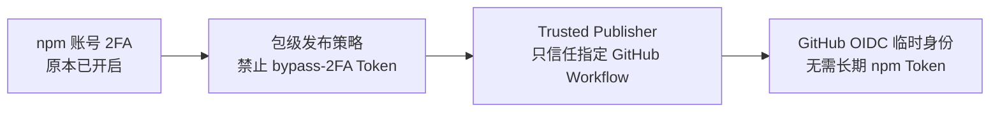
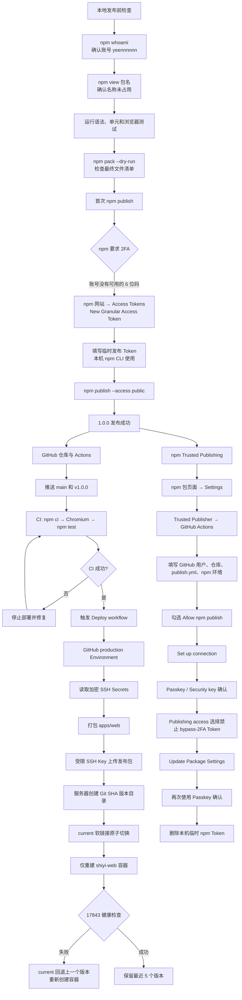
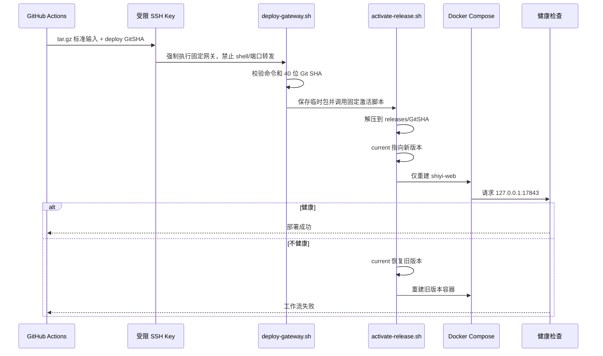

# npm 发布与 GitHub CI/CD 配置记录

本文记录拾忆 `1.0.0` 首次发布及自动部署的实际过程，方便维护者理解每一项设置的作用和后续发布方式。

## 先说明 2FA

本次操作**没有开启 npm 账号的双因素认证**。在修改 npm 设置之前，命令 `npm profile get --json` 已返回：

```json
{
  "tfa": {
    "mode": "auth-and-writes"
  }
}
```

这表示账号此前已经要求登录和写操作使用 2FA。本次实际修改的是：

- 为 `shiyi-browser-study-assistant` 配置 GitHub Actions OIDC Trusted Publisher。
- 将该包的 Publishing access 改为“Require two-factor authentication and disallow bypass 2FA tokens”。
- 删除本机临时 npm Token，使后续自动发布不依赖长期 Token。

账号级 2FA、包级 Publishing access 和 OIDC 是三层不同设置：



## 实际配置流程



## GitHub 页面点击记录

### 创建生产部署环境

1. 打开仓库 **Settings**。
2. 左侧进入 **Environments**。
3. 点击 **New environment**。
4. 输入 `production`。
5. 点击 **Configure environment**。
6. 在 **Environment secrets** 中逐个点击 **Add environment secret**，添加：

| Secret | 用途 |
| --- | --- |
| `DEPLOY_HOST` | 阿里云主机地址 |
| `DEPLOY_PORT` | SSH 端口 |
| `DEPLOY_USER` | 受限部署密钥使用的 SSH 用户 |
| `DEPLOY_SSH_KEY` | 只允许执行拾忆部署网关的专用私钥 |
| `DEPLOY_KNOWN_HOSTS` | 固定服务器主机公钥，防止连接到伪造主机 |

这些值只保存在 GitHub 加密 Secrets 中，没有写入仓库。

### 配置 npm Trusted Publisher

1. 打开 npm 包 `shiyi-browser-study-assistant`。
2. 点击包页面的 **Settings**。
3. 在 **Trusted Publisher** 下点击 **GitHub Actions**。
4. `Organization or user` 填写 `cskldjfhlfw`。
5. `Repository` 填写 `XingCe-GongZhuan-Chinese-Memory`。
6. `Workflow filename` 填写 `publish.yml`。
7. `Environment name` 填写 `npm`。
8. 勾选 **Allow npm publish**。
9. 点击 **Set up connection**。
10. npm 跳转到 **Two-Factor Authentication → Security key**。
11. 点击 **Use security key**，通过 Passkey 完成确认。
12. 返回包设置后，在 **Publishing access** 选择 **Require two-factor authentication and disallow bypass 2FA tokens (recommended)**。
13. 点击 **Update Package Settings**。
14. 再次点击 **Use security key** 完成安全确认。

## 服务器端发生了什么



服务器上的其他 `lumitime` 容器不在 Compose 文件和部署脚本的操作范围内。部署过程仅操作 `/opt/shiyi`、`shiyi-web` 和端口 `17843`。

## 首轮失败与修复

第一轮 CI 和 npm 标签检查失败，不是 npm 或服务器故障，而是 `.gitignore` 中原来的 `data/` 会匹配任意层级，导致 `apps/web/src/data/peanut800.json` 没有提交到 GitHub。处理过程是：

1. 将规则改成只忽略仓库根目录的 `/data/`。
2. 把 `apps/web/src/data/peanut800.json` 加入 Git。
3. 重新推送 `main` 并校正 `v1.0.0` 标签。
4. 第二轮 `CI`、`Publish npm` 和 `Deploy` 全部成功。

这个失败也验证了保护逻辑：CI 失败时，Deploy 工作流被跳过，线上页面没有被错误版本覆盖。

## 日常更新网页

普通代码更新只需要提交并推送 `main`：

```bash
git add .
git commit -m "描述本次修改"
git push origin main
```

GitHub 会自动测试；测试成功后自动部署到 `17843`。

## 发布新的 npm 版本

修复版本使用：

```bash
npm version patch
git push origin main --follow-tags
```

新功能或不兼容修改分别使用 `npm version minor` 或 `npm version major`。标签必须与 `package.json` 版本一致，`publish.yml` 才会发布。OIDC 发布过程不需要在 GitHub 保存 npm Token。

